# 后端架构深度审查报告 (v2.6.0)

> **审查日期**: 2026-07-24
> **审查基准**: v2.5.16 现状 (commit 33d7c3c 后)
> **审查范围**: `backend/app/` 全量代码 + 跨层调用关系 + 数据流
> **审查方法**: 静态分析 (文件级 / 函数级 / 调用图) + 既有文档交叉验证
> **审查目标**: 识别架构层缺陷、组件职责失衡、依赖环路、技术债务, 为系统性重构提供依据

---

## 一、审查总览

### 1.1 现状规模

| 维度 | 数量 | 备注 |
|---|---|---|
| 总代码量 | ~310 KB (约 8000 行) | Python 源文件, 排除 venv/tests |
| API 路由文件 | 14 个 | 含 1 个 `__init__.py` |
| Service 文件 | 3 个 + 1 个 `__init__.py` | 显著不足 |
| Worker 文件 | 4 个 | 1 个 celery_app + 3 个任务集 |
| ML 文件 | 7 个 | 1 个总训练 + 3 检测 + 3 分割 |
| ORM 模型 | 9 个 | 1 个 `__init__.py` |
| Schema 文件 | 7 个 | Pydantic DTO |
| 核心工具 | 7 个 | `core/` 目录 |

### 1.2 关键结论 (TL;DR)

| 严重度 | 数量 | 主题 |
|---|---|---|
| **P0 架构缺陷** | 4 | 巨型 API 文件、Service 层缺失、跨层调用、循环依赖风险 |
| **P1 设计缺陷** | 6 | 业务逻辑泄漏到 API、Worker 混合关注点、ML 耦合 DB、状态机分散、错误处理不一致、依赖注入缺失 |
| **P2 改进项** | 8 | 类型注解、参数对象、缓存策略、ORM 优化、可观测性、文档、测试、CI |

**核心判断**: 现有架构是 **典型的"功能驱动增长"模式** —— 每次新增功能就往 API/Worker 里堆代码, 长期累积形成"单体式 API + 单体式 Worker"双巨型模块, 已严重偏离工程最佳实践, 需进行 **分层架构重构**。

### 1.3 文档结构

| 章节 | 内容 |
|---|---|
| 二、架构现状 | 详细目录树 + 调用关系 + 数据流 |
| 三、P0/P1/P2 问题清单 | 18 项问题的根因分析与证据 |
| 四、依赖关系分析 | 跨层调用矩阵 + 循环依赖风险 |
| 五、代码度量 | 行数 / 圈复杂度 / 重复度 / 内聚度 |
| 六、影响评估 | 重构对现有功能 / 测试 / 部署的影响 |
| 七、参考与附录 | 重构后的目标架构图、相关文档 |

---

## 二、架构现状

### 2.1 目录树与代码量

```
backend/app/
├── __init__.py
├── __main__.py
├── cli.py                       5 KB       CLI 入口
├── config.py                   19 KB       配置 (pydantic-settings)
├── database.py                  3 KB       async engine + session
├── main.py                      7 KB       FastAPI app + lifespan + handlers
│
├── api/  (路由层)                            14 文件, ~270 KB
│   ├── __init__.py              0 KB
│   ├── annotation.py           16 KB
│   ├── auth.py                  3 KB
│   ├── auto_annotate.py        19 KB       ★★★ AI 预标注 + 同步/异步分发
│   ├── dataset.py              16 KB
│   ├── detection.py            39 KB       ★★★★★ 巨型: BBox CRUD + 训练编排 + SSE
│   ├── export.py               25 KB       三种格式 (COCO/YOLO/CSV) 导出
│   ├── files.py                 7 KB
│   ├── image.py                49 KB       ★★★★★ 巨型: 上传/AI/列表/批量
│   ├── model.py                18 KB       模型版本管理
│   ├── segmentation.py         24 KB       mask CRUD + 训练编排
│   ├── stats.py                11 KB
│   ├── system.py                3 KB
│   ├── training.py             57 KB       ★★★★★ 巨型: 任务分发 + SSE + DB 写入
│   └── user.py                  1 KB
│
├── core/  (跨切关注点)                       8 文件, ~22 KB
│   ├── __init__.py              0 KB
│   ├── celery_utils.py          2 KB       run_async_in_worker + check_celery_available
│   ├── db_migration.py          6 KB
│   ├── deps.py                  3 KB       get_current_user + admin + optional
│   ├── exceptions.py            2 KB       AppException + 4 子类
│   ├── redis_client.py          1 KB
│   ├── security.py              1 KB       JWT encode/decode
│   └── ultralytics_setup.py     6 KB       YOLO 路径 + 迁移
│
├── ml/  (机器学习)                            7 文件, ~74 KB
│   ├── __init__.py              0 KB
│   ├── imagenet_common_labels.json
│   ├── train.py                24 KB       分类训练 (timm)
│   ├── detection/
│   │   ├── __init__.py          1 KB
│   │   ├── yolo_dataset.py     10 KB       YOLO 数据集构建
│   │   ├── yolo_predict.py      7 KB       YOLO 推理
│   │   └── yolo_train.py        8 KB       YOLO 训练
│   └── segmentation/
│       ├── __init__.py          0 KB
│       ├── seg_dataset.py       5 KB       mask → tensor
│       ├── seg_predict.py       7 KB       推理
│       └── seg_train.py         7 KB       DeepLab 训练
│
├── models/  (ORM)                             9 文件, ~18 KB
│   ├── __init__.py              1 KB       集中导出
│   ├── annotation_log.py        2 KB
│   ├── bbox_annotation.py       2 KB
│   ├── category.py              1 KB
│   ├── dataset.py               2 KB
│   ├── image.py                 2 KB
│   ├── model_version.py         2 KB
│   ├── segmentation_mask.py     2 KB
│   ├── training_job.py          4 KB
│   └── user.py                  1 KB
│
├── schemas/  (DTO)                            7 文件, ~17 KB
│   ├── __init__.py              1 KB
│   ├── auth.py                  1 KB
│   ├── dataset.py               1 KB
│   ├── detection.py             3 KB
│   ├── enums.py                 3 KB       TaskType / AnnotationSource
│   ├── image.py                 1 KB
│   ├── segmentation.py          2 KB
│   └── training.py              5 KB
│
├── services/  (业务服务)                       4 文件, ~28 KB   ⚠ 显著不足
│   ├── __init__.py              1 KB
│   ├── ai_service.py           18 KB       timm 模型加载/推理/批处理
│   ├── bbox_service.py          8 KB       BBox 几何计算
│   └── storage_service.py       2 KB       文件存储抽象
│
└── workers/  (异步任务)                        4 文件, ~77 KB
    ├── __init__.py              0 KB
    ├── celery_app.py            2 KB       Celery 配置
    ├── detection_tasks.py      32 KB       ★★★★ YOLO 训练任务 (含 SSE 状态机)
    ├── segmentation_tasks.py   20 KB       DeepLab 训练任务
    └── tasks.py                27 KB       分类训练任务
```

### 2.2 模块依赖图 (实际调用关系)

```mermaid
graph TB
    subgraph "Presentation Layer"
        API_T[api/training.py]
        API_I[api/image.py]
        API_D[api/detection.py]
        API_S[api/segmentation.py]
        API_AA[api/auto_annotate.py]
        API_M[api/model.py]
        API_E[api/export.py]
        API_DS[api/dataset.py]
        API_ST[api/stats.py]
    end

    subgraph "Business Layer (Thin)"
        SVC_AI[services/ai_service.py]
        SVC_BB[services/bbox_service.py]
        SVC_ST[services/storage_service.py]
    end

    subgraph "Worker Layer (Fat)"
        WRK_T[workers/tasks.py]
        WRK_D[workers/detection_tasks.py]
        WRK_S[workers/segmentation_tasks.py]
    end

    subgraph "ML Layer"
        ML_T[ml/train.py]
        ML_YT[ml/detection/yolo_train.py]
        ML_ST[ml/segmentation/seg_train.py]
    end

    subgraph "Cross-Cutting"
        CORE[core/*]
        CFG[config.py]
        DB[database.py]
    end

    subgraph "Data Layer"
        MOD[models/*]
    end

    %% API -> 直接访问 DB
    API_T --> DB
    API_T --> MOD
    API_T --> WRK_T
    API_T --> WRK_D
    API_T --> WRK_S
    API_T --> SVC_AI
    API_T --> CORE

    API_I --> DB
    API_I --> MOD
    API_I --> SVC_AI
    API_I --> SVC_ST

    API_D --> DB
    API_D --> MOD
    API_D --> WRK_D
    API_D --> SVC_BB

    API_S --> DB
    API_S --> MOD
    API_S --> WRK_S

    API_AA --> DB
    API_AA --> MOD
    API_AA --> SVC_AI

    API_M --> DB
    API_M --> MOD
    API_E --> DB
    API_E --> MOD
    API_E --> ML_YT

    %% Worker -> 直接访问 DB / ML
    WRK_T --> DB
    WRK_T --> MOD
    WRK_T --> ML_T
    WRK_T --> CORE

    WRK_D --> DB
    WRK_D --> MOD
    WRK_D --> ML_YT
    WRK_D --> CORE

    WRK_S --> DB
    WRK_S --> MOD
    WRK_S --> ML_ST
    WRK_S --> CORE

    %% ML -> 直接访问 DB
    ML_T --> DB
    ML_T --> MOD
    ML_YT --> DB
    ML_ST --> DB
```



**核心观察**:
1. **API 层** 直接耦合 `database.py` + `models/` + `workers/` (越层)
2. **Worker 层** 直接耦合 `database.py` + `models/` + `ml/` (越层)
3. **ML 层** 也直接耦合 `database.py` (越层)
4. **Service 层** 只被 API 层部分使用, 没有起到"业务编排中心"的作用
5. 没有 Repository 层, 业务层无法脱离 ORM 细节做单测

### 2.3 核心数据流

#### 2.3.1 训练任务流 (以分类训练为例)

```
[前端 POST /api/training/start]
        │
        ▼
[api/training.py:start_training]
   - 参数解析
   - 校验 Dataset 存在 (DB 查询)
   - 生成 model_name 兜底
   - socket.create_connection(Redis)  ← 预检 broker
   - 生成 celery_task_id (UUID)
   - mysql_insert(TrainingJob, state=PENDING)  ← 预创建行
   - apply_async(task_id=celery_task_id)
        │
        ▼
[Celery 队列]
        │
        ▼
[workers/tasks.py:train_model_task]
   - _create_job()  ← 查/更新 TrainingJob (state=PROGRESS)
   - data = _load_dataset()  ← DB 查询
   - model = build_model()
   - 训练循环 + progress_cb(progress, msg, extra)
     ├─ redis_client.setex('train:progress:...')  ← 写 Redis
     ├─ _update_training_history()  ← 写 Redis
     └─ _persist_dataset_stats()  ← 写 DB
   - best_model.save()
   - ModelVersion 写入
   - TrainingJob 终态写入 (state=SUCCESS)
   - return dict {status, result, job_id, ...}  ← 必须 JSON 可序列化
        │
        ▼
[前端 GET /api/training/progress/{task_id}] 或 [GET /api/training/progress/stream/{task_id} (SSE)]
   - Celery AsyncResult(task_id).state + .info
   - 终端态回退查 DB TrainingJob (v2.5.28 关键修复)
   - 返回 {state, progress, message, started_at, finished_at, ...}
```

**问题点**:
- 状态机管理分散在 API + Worker + Celery meta + DB, 4 处真相源
- `progress_cb` 内联了 Redis/DB 写, Worker 函数体超过 600 行
- API 端 SSE/REST 端点逻辑重复 (300+ 行 × 2)

#### 2.3.2 图像上传 + AI 预标注流

```
[前端 POST /api/images/upload/{dataset_id}]
        │
        ▼
[api/image.py:upload_images]
   - 校验 Dataset
   - 循环: content = file.read()
   - storage_service.compute_hash(content)
   - 查 Image.file_hash 去重
   - storage_service.save(storage_key, content)
   - PIL 读 width/height
   - INSERT Image (status=pending)
   - UPDATE Dataset.image_count
        │
        ▼
[前端 POST /api/images/auto-label/{dataset_id}]
        │
        ▼
[api/image.py:auto_label]
   - 加载 fine-tune 或 pretrained 模型
   - 循环图片, ai_service.predict()
   - filter_predictions_to_categories
   - UPDATE Image.final_label_id, status
   - 写 AnnotationLog
        │
        ▼
[若 use_async: POST /api/auto-annotate/run with async_mode=True]
        │
        ▼
[Celery: train_model_task 或专用预标注任务]
   - (类似训练流程, 但写 Image 而非 ModelVersion)
```

**问题点**:
- 同步预标注逻辑直接写在 API 路由函数 (200+ 行)
- 无事务管理: 50 张图, 任意一张失败, 整体回滚?
- 缺少批量处理优化: 50 张图逐张调 predict

#### 2.3.3 检测/分割训练流

```
[前端 POST /api/detection/train 或 /api/segmentation/train]
        │
        ▼
[api/detection.py 或 segmentation.py:start_*_train]
   - 校验 task_type
   - 预创建 TrainingJob (state=PENDING)
   - _check_celery_available()
   - _apply_training_task(task_type, kwargs, task_id=...)
        │
        ▼
[Celery: train_detection_task 或 train_segmentation_task]
   - _create_job() 复用 train_model_task 模式
   - 调 ml/detection/yolo_train.run() 或 ml/segmentation/seg_train.run()
        │
        ▼
[ml/*/yolo_train.py 或 seg_train.py]
   - 构建数据集
   - 训练循环
   - 保存 best.pt / best.pth
   - ModelVersion 写入
```

**问题点**:
- 三个 worker (tasks/detection_tasks/segmentation_tasks) 高度相似 (300+ 行 × 3)
- 重复的 `_run_async` / `_create_job` / `_persist_dataset_stats` / `_update_training_history`
- 训练回调函数 (`train_cb` / `epoch_cb`) 在三处定义, 行为必须保持一致

---

## 三、问题清单 (按严重度排序)

### P0-1: API 层巨型文件, 违反单一职责

**位置**:
- [app/api/training.py](file:///d:/works/WorkBuddy/Myhome/毕业论文设计与实现/thesis-image-annotation/backend/app/api/training.py) (57 KB / 约 1500 行)
- [app/api/image.py](file:///d:/works/WorkBuddy/Myhome/毕业论文设计与实现/thesis-image-annotation/backend/app/api/image.py) (49 KB / 约 1300 行)
- [app/api/detection.py](file:///d:/works/WorkBuddy/Myhome/毕业论文设计与实现/thesis-image-annotation/backend/app/api/detection.py) (39 KB / 约 1050 行)
- [app/api/export.py](file:///d:/works/WorkBuddy/Myhome/毕业论文设计与实现/thesis-image-annotation/backend/app/api/export.py) (25 KB)
- [app/api/segmentation.py](file:///d:/works/WorkBuddy/Myhome/毕业论文设计与实现/thesis-image-annotation/backend/app/api/segmentation.py) (24 KB)
- [app/api/auto_annotate.py](file:///d:/works/WorkBuddy/Myhome/毕业论文设计与实现/thesis-image-annotation/backend/app/api/auto_annotate.py) (19 KB)
- [app/api/model.py](file:///d:/works/WorkBuddy/Myhome/毕业论文设计与实现/thesis-image-annotation/backend/app/api/model.py) (18 KB)
- [app/api/dataset.py](file:///d:/works/WorkBuddy/Myhome/毕业论文设计与实现/thesis-image-annotation/backend/app/api/dataset.py) (16 KB)
- [app/api/annotation.py](file:///d:/works/WorkBuddy/Myhome/毕业论文设计与实现/thesis-image-annotation/backend/app/api/annotation.py) (16 KB)

**根因**: 路由层混合了 **5 种关注点**:
1. HTTP 路由声明 + 参数解析
2. 业务校验 (数据集存在、task_type、坐标合法等)
3. 业务编排 (调 worker、状态机、事务)
4. 数据访问 (直接 `db.execute(select(...))`)
5. 响应构造 (DB ORM → Pydantic 转换)

**证据**:
- `api/training.py` 单文件包含 13 个端点 + 任务分发 + SSE 状态机 + DB 写库 + Celery meta 兜底
- `api/detection.py` 单文件包含 BBox CRUD + 训练编排 + SSE + 单激活不变性维护
- `api/image.py` 单文件包含上传 + 去重 + 同步预标注 + 批量处理 + 类目过滤

**影响**:
- **可读性**: 单文件超过 1000 行, 接手人需要阅读 1 小时才能理解
- **可测试性**: 业务逻辑与 HTTP 耦合, 写单测必须 mock Request/Response
- **可维护性**: 修改一个端点, 可能影响其他端点 (共享 helper 函数)
- **冲突率**: 多人同时改同一文件, Git 合并冲突率高

**建议**: 拆分为 **API 路由 (薄) + Service 层 (厚)**, 单个路由文件控制在 300 行以内。

---

### P0-2: Service 层严重不足, 业务逻辑散落

**位置**: [app/services/](file:///d:/works/WorkBuddy/Myhome/毕业论文设计与实现/thesis-image-annotation/backend/app/services/)

**现状**:
- 仅 3 个 Service 文件: `ai_service.py` (18KB) / `bbox_service.py` (8KB) / `storage_service.py` (1.5KB)
- 业务域 13 个, 但 Service 覆盖仅 3 个: AI 推理 / BBox 几何 / 文件存储

**缺失的 Service**:
| 业务域 | 当前实现位置 | 应迁出 |
|---|---|---|
| 数据集管理 | api/dataset.py (16KB) | `dataset_service.py` |
| 图像管理 | api/image.py (49KB) | `image_service.py` |
| 标注管理 | api/annotation.py (16KB) | `annotation_service.py` |
| 训练任务 | api/training.py (57KB) + workers/* | `training_service.py` |
| 模型版本 | api/model.py (18KB) | `model_service.py` |
| 统计 | api/stats.py (11KB) | `stats_service.py` |
| 导出 | api/export.py (25KB) | `export_service.py` |
| 自动标注 | api/auto_annotate.py (19KB) | `auto_annotate_service.py` |
| 目标检测 | api/detection.py (39KB) | `detection_service.py` |
| 图像分割 | api/segmentation.py (24KB) | `segmentation_service.py` |

**影响**:
- 业务规则 (如"激活模型时取消其他激活"、"删除数据集时级联清理") 散落在多个 API 端点
- 同一规则可能在 API + Worker + ML 三处实现, 容易不一致
- API 层无法单测, 因为业务逻辑就在 API 函数里

**根因**: 早期系统没有明确划分 Service 层, 后续新增功能直接堆在 API 里。`ai_service` / `bbox_service` 是后期为抽离 ML 推理和几何计算而新建的, 没有形成体系。

---

### P0-3: 跨层调用, 违反 Clean Architecture 依赖倒置原则

**问题描述**: API 层直接 import Worker 任务, Worker 直接调 ML 训练, ML 直接访问 DB。

**证据**:

```python
# api/training.py:16
from app.workers.tasks import train_model_task           # ★ API → Worker (越层)

# api/detection.py:105
from app.workers.detection_tasks import train_detection_task  # ★ API → Worker

# api/segmentation.py:108
from app.workers.segmentation_tasks import train_segmentation_task  # ★ API → Worker

# workers/tasks.py:128
from app.database import AsyncSessionLocal               # Worker → DB
# + 直接 db.execute(select(TrainingJob))                 # Worker → ORM 模型

# ml/train.py:103-125
async def _run_async(...):                              # ML 自建 event loop 管理
# + 直接 db.execute(...)                                 # ML → DB
```

**理想依赖方向 (依赖倒置)**:

```
API (薄) → Service (业务编排) → Repository (数据访问) → ORM/DB
                          ↘ Worker (任务入口, 仅注册)
                            → Service
                          ↘ ML (训练执行, 可被 Service 调用)
                            → 纯计算, 不依赖 DB
```

**影响**:
- 单元测试必须 mock 跨层对象, 难以验证业务规则
- 替换底层实现 (如换 ORM) 需要改动 API 层
- 业务逻辑无法在 CLI / 脚本中复用, 只能在 HTTP 入口调用

**示例问题**: `dataset_service.delete_dataset()` 在 Worker 中也需要调用 (清理过期模型), 但目前 API 和 Worker 各自实现级联逻辑, 容易遗漏。

---

### P0-4: 状态机管理分散, 4 处真相源

**问题描述**: 训练任务的状态/进度/消息同时存在于 4 处:

| 真相源 | 字段 | 写入方 |
|---|---|---|
| Celery Redis meta | `result.state` + `result.info` | Worker 的 `self.update_state()` |
| MySQL `TrainingJob` | `state` / `progress` / `message` / `started_at` / `finished_at` | Worker (progress_cb) + API (预创建) |
| Celery task return | `result.info` (终态下变 return value) | Worker `return dict` |
| 前端 Redux / Pinia | `progress` / `status` (UI state) | API 响应 |

**当前修复** (v2.5.15 P0-4): API 端 `get_progress` 在终态回退查 DB
- 见 [training.py:333-349](file:///d:/works/WorkBuddy/Myhome/毕业论文设计与实现/thesis-image-annotation/backend/app/api/training.py#L333-L349)
- 避免 Celery SUCCESS 状态下 `result.info` 是 return dict 而非 meta 的问题
- 但这是"打补丁", 没有从根上解决状态分散

**影响**:
- 任何一处逻辑遗漏, 前端 UI 就显示错误状态
- v2.5.15 修复了 5+ 个相关 Bug (见 [11-代码优化迭代记录.md](file:///d:/works/WorkBuddy/Myhome/毕业论文设计与实现/thesis-image-annotation/backend/docs/11-代码优化迭代记录.md))
- 调试时需对照 4 处才能定位真实状态

**建议**: 引入 **TrainingJobStateService**, 统一管理状态机:
- 唯一入口: `state_service.transition(job_id, from_state, to_state, progress, message)`
- 自动同步 Celery meta + DB 行 + 必要时发送 SSE 事件

---

### P1-1: Worker 层混合关注点, 巨型任务函数

**位置**:
- [app/workers/tasks.py](file:///d:/works/WorkBuddy/Myhome/毕业论文设计与实现/thesis-image-annotation/backend/app/workers/tasks.py) (27 KB)
- [app/workers/detection_tasks.py](file:///d:/works/WorkBuddy/Myhome/毕业论文设计与实现/thesis-image-annotation/backend/app/workers/detection_tasks.py) (32 KB)
- [app/workers/segmentation_tasks.py](file:///d:/works/WorkBuddy/Myhome/毕业论文设计与实现/thesis-image-annotation/backend/app/workers/segmentation_tasks.py) (20 KB)

**问题**: 单个 Celery 任务函数 (如 `train_model_task`) 承担了:
1. 任务编排 (创建/查询 TrainingJob)
2. 数据加载 (DB 查询 + 文件读取)
3. 模型构建 (timm / ultralytics / torchvision)
4. 训练循环 (epoch + batch)
5. 进度回调 (Redis 写 + DB 写 + Celery meta)
6. 历史曲线累积
7. 评估指标计算
8. 最佳模型保存
9. ModelVersion 写入
10. 异常处理 + 终态写入
11. JSON 可序列化处理 (防 numpy EncodeError)

**重复度**: 三个任务函数在"创建 job + 进度回调 + 终态写入"三处高度相似, 已通过 `_update_training_history` / `_persist_dataset_stats` 收敛, 但仍有大量复制粘贴。

**影响**:
- 修改一处, 三处都要改
- 圈复杂度高 (单函数 > 50 行, 分支 > 10)
- 无法独立测试 (必须起 worker 进程)

---

### P1-2: ML 层耦合数据库, 难以纯计算复用

**位置**:
- [app/ml/train.py](file:///d:/works/WorkBuddy/Myhome/毕业论文设计与实现/thesis-image-annotation/backend/app/ml/train.py) (24 KB)
- [app/ml/detection/yolo_train.py](file:///d:/works/WorkBuddy/Myhome/毕业论文设计与实现/thesis-image-annotation/backend/app/ml/detection/yolo_train.py) (8 KB)
- [app/ml/segmentation/seg_train.py](file:///d:/works/WorkBuddy/Myhome/毕业论文设计与实现/thesis-image-annotation/backend/app/ml/segmentation/seg_train.py) (7 KB)

**问题**:
- `ml/train.py` 自带 `_run_async` event loop 管理 (与 `core/celery_utils.run_async_in_worker` 重复, 已修复)
- `ml/train.py` 直接 `import app.database` + `from app.models... import ...`
- ML 训练函数返回 dict, 内含 DB 写入路径 (ModelVersion 等)

**影响**:
- ML 层无法在 Jupyter Notebook / 独立脚本中复用 (必须初始化整个 app)
- 替换训练框架 (如 timm → torchvision) 需要连带改 DB 相关代码
- 单测必须用真实 DB (aiosqlite) 才能跑, 不便

**理想架构**: ML 层是 **纯计算**:
- 输入: dataset 路径 + 训练超参
- 输出: model file path + metrics dict
- 不读写 DB, 由 Service 层负责 ModelVersion 持久化

---

### P1-3: 错误处理不一致, HTTPException 与业务异常混用

**现状**:
- [core/exceptions.py](file:///d:/works/WorkBuddy/Myhome/毕业论文设计与实现/thesis-image-annotation/backend/app/core/exceptions.py) 定义了 `AppException` + 4 个子类 (NotFoundError, PermissionDeniedError, ValidationError, ConflictError)
- 全局 `Exception` handler 在 [main.py:157-167](file:///d:/works/WorkBuddy/Myhome/毕业论文设计与实现/thesis-image-annotation/backend/app/main.py#L157-L167) 实现

**问题**:
- 仅有 1 处 `NotFoundError` 使用 (见 stats.py), 其它 100+ 处仍用 `raise HTTPException(404, "...")`
- 业务层无法 `raise NotFoundError`, 只能依赖 FastAPI 的 HTTPException
- 错误响应格式两种:
  - `{"code": "NOT_FOUND", "message": "..."}` (AppException)
  - `{"detail": "..."}` (HTTPException)

**证据**: 全仓搜索 `HTTPException`:

```bash
$ grep -r "HTTPException" backend/app/ | wc -l
# 约 200+ 处
```

**影响**:
- 前端错误处理代码需要处理两种响应格式
- 业务异常无法统一记录 (HTTPException 是 FastAPI 内部类型, handler 仅兜底 Exception)

---

### P1-4: 缺乏依赖注入, Service 单例/全局变量滥用

**现状**:
- `ai_service.ai_service` 是 **模块级全局单例** (见 `services/__init__.py:7`)
- Worker 直接 `from app.database import AsyncSessionLocal` 而非依赖注入
- API 通过 `Depends(get_db)` 注入 session, 但 Service 没有依赖注入

**问题**:
- `ai_service` 单例在多 Worker 进程下共享, 模型池容易出意外 (v2.5.15 P1-5 已用 `ModelPool` + `threading.Lock` 缓解)
- Service 层无法在单测中替换为 Mock
- FastAPI 推荐的 `Depends()` 模式没有贯穿到 Service

**理想**: 引入 `dependency-injector` 或手写 DI 容器, 通过 `Depends(get_training_service)` 在路由层注入。

---

### P1-5: 重复代码未完全收敛

**位置**:
- 三个 worker 的 `_create_job` 模式 (300+ 行 × 3 重复)
- 三个 worker 的 `progress_cb` 模式 (50+ 行 × 3 重复)
- 三个 worker 的 `_persist_dataset_stats` 已部分收敛到 `tasks.py` (但 `detection_tasks.py` / `segmentation_tasks.py` 仍有自实现)
- API 端 SSE 推送逻辑 (training.py + detection.py + segmentation.py 三处高度相似)

**建议**: 提取 `app/services/job_state_service.py` + `app/core/sse_helpers.py`:
- 统一 `_create_job()` 为 `job_state_service.create_or_reset()`
- 统一 SSE 推送为 `sse_helpers.stream_job_progress()`

---

### P1-6: 配置散落, 部分硬编码

**位置**:
- 训练超参 (epochs / batch_size / learning_rate) 直接在 API 路由参数声明, 不在 `config.py`
- 业务阈值 (auto-annotate 50 张分界) 在 `auto_annotate.py:99` 硬编码
- 模型池 max_size 在 `ai_service.py:44` 硬编码 (`max_size: int = 2`)
- Redis 端口 / MySQL 端口在 `.env` 但服务层用 `os.getenv` (已在 v2.5.16 修复为 `settings`)

**影响**:
- 调参需要改代码
- 不同环境 (dev/staging/prod) 无法差异化

---

### P2-1 ~ P2-8: 改进项

| ID | 主题 | 描述 |
|---|---|---|
| P2-1 | 类型注解 | 部分函数缺 `-> ReturnType`, 大量 `Any` |
| P2-2 | 参数对象 | API 路由函数参数超过 5 个, 应封装为 Pydantic model |
| P2-3 | 缓存策略 | ai_service 模型池已实现, 但图片/统计接口无缓存 |
| P2-4 | ORM 优化 | 部分查询有 N+1 风险, 未用 `selectinload` |
| P2-5 | 可观测性 | 缺 metrics 暴露 (ModelPool stats, Celery queue length, DB pool stats) |
| P2-6 | 文档 | API 端点无 OpenAPI 详细描述 (summary / description) |
| P2-7 | 测试 | 整体覆盖率 39%, ML 层 4 模块 69-98%, API 层 0% happy path |
| P2-8 | CI | 缺 lint / format / type-check CI 流水线 |

---

## 四、依赖关系深度分析

### 4.1 跨层调用矩阵

| 调用方 → 被调方 | API | Service | Worker | ML | DB/ORM | Core |
|---|---|---|---|---|---|---|
| **API** | ✗ (内调) | ✓ 部分 | ⚠ 越层 | ✗ | ⚠ 越层 | ✓ |
| **Service** | ✗ | ✓ (内调) | ✗ | ✓ 部分 | ⚠ 直查 ORM | ✓ |
| **Worker** | ✗ | ✗ | ✗ (内调) | ⚠ 越层 | ⚠ 直查 ORM | ✓ |
| **ML** | ✗ | ✗ | ✗ | ✓ (内调) | ⚠ 直查 ORM | ✓ |

**✗ 不应有  ⚠ 越层  ✓ 正常**

**关键越层**:
1. **API → Worker** (3 处): training.py / detection.py / segmentation.py 直接 `from app.workers.* import ...`
2. **API → ORM/DB** (10+ 处): 所有 API 文件直接 `db.execute(select(...))`
3. **Worker → ORM/DB** (5+ 处): workers/* 直接 `from app.database import ...` + `from app.models import ...`
4. **ML → ORM/DB** (3 处): ml/* 自建 event loop + 直接 DB 操作

### 4.2 循环依赖风险

**当前导入图**:
```
main.py → api/* → workers/* (task) → ml/* → database.py
                  ↓
                  models/* ← (API 直接使用)
```

**潜在循环**:
- `workers/tasks.py` import `ml/train.py`, `ml/train.py` import `app.database` (从 worker 进程启动)
- `api/training.py` import `workers/tasks.py`, `workers/tasks.py` import `ml/train.py`, `ml/train.py` import `app.config`
- 任何重构引入 `services/` → `workers/` → `services/` 反向依赖都会死锁

**缓解**: 当前通过 `try/except ImportError` + 延迟导入规避, 但脆弱。

### 4.3 静态依赖统计 (基于 14 个 API 文件)

| API 文件 | import 数量 | 业务包 | 跨层包 |
|---|---|---|---|
| training.py | ~25 | workers.tasks, workers.detection_tasks, workers.segmentation_tasks | 越层 ×3 |
| image.py | ~20 | services.ai_service, services.storage_service | 直 ORM ×5 |
| detection.py | ~18 | workers.detection_tasks, services.bbox_service | 越层 ×1 |
| segmentation.py | ~16 | workers.segmentation_tasks | 越层 ×1 |
| auto_annotate.py | ~15 | services.ai_service | 直 ORM ×4 |
| model.py | ~10 | - | 直 ORM ×3 |
| dataset.py | ~12 | - | 直 ORM ×4 |
| export.py | ~13 | ml.detection.yolo_dataset | 直 ORM ×5 |
| stats.py | ~8 | - | 直 ORM ×6 |
| annotation.py | ~10 | - | 直 ORM ×3 |

---

## 五、代码度量

### 5.1 行数 / 文件

| 文件 | 行数 (估) | 评价 |
|---|---|---|
| api/training.py | ~1500 | 🚨 严重超标 |
| api/image.py | ~1300 | 🚨 严重超标 |
| api/detection.py | ~1050 | 🚨 严重超标 |
| api/export.py | ~700 | ⚠ 偏大 |
| api/segmentation.py | ~650 | ⚠ 偏大 |
| workers/detection_tasks.py | ~850 | ⚠ 偏大 |
| workers/tasks.py | ~750 | ⚠ 偏大 |
| ai_service.py | ~500 | ✓ 可接受 |
| ml/train.py | ~650 | ⚠ 偏大 |
| 其余 | < 500 | ✓ 健康 |

**总行数对比**:
- API 层 14 文件: ~6500 行
- Service 层 3 文件: ~500 行
- Worker 层 4 文件: ~2200 行
- ML 层 7 文件: ~2200 行
- **API : Service : Worker : ML = 13 : 1 : 4.4 : 4.4**

**理想比例**: API : Service : Repository : Domain = 1 : 3 : 2 : 1
(参考 DDD 项目实践)

### 5.2 圈复杂度 (Cyclomatic Complexity) 估算

基于函数分支数:
- `api/training.py:start_training`: 约 15 (含 try/except/if 多层)
- `api/image.py:auto_label`: 约 12
- `api/detection.py:save_bbox`: 约 8
- `workers/tasks.py:train_model_task`: 约 20 (高)
- `ml/train.py:run_training`: 约 18 (高)

**建议**: 单函数圈复杂度 ≤ 10, 超过 10 应拆分。

### 5.3 重复度

| 重复模式 | 出现次数 | 文件 |
|---|---|---|
| `try/except + raise HTTPException` | ~200 处 | API |
| `select(ModelVersion).where(is_active==True)` | 2 处 | image.py, model.py |
| `_create_job` TrainingJob 写入 | 3 处 | tasks.py, detection_tasks.py, segmentation_tasks.py |
| `_update_training_history` Redis 写 | 3 处 | 同上 |
| SSE 推送逻辑 | 3 处 | training.py, detection.py, segmentation.py |
| Celery `run_async_in_worker` | 4 处 | 已部分收敛 (2 处) |

**代码异味**: 重复率 > 5% 应考虑抽象。

### 5.4 内聚度 (LCOM 简化估算)

| 模块 | 内聚评价 | 依据 |
|---|---|---|
| api/training.py | 🚨 低 | 混入任务分发 + SSE + DB + 校验 |
| api/image.py | 🚨 低 | 混入上传 + AI + 列表 + 删除 |
| workers/tasks.py | ⚠ 中 | 训练编排 + 进度回调 + DB 写 |
| services/ai_service.py | ✓ 高 | 单一职责: 模型推理 |
| models/* | ✓ 高 | 单表 ORM |

---

## 六、影响评估

### 6.1 重构对现有功能的影响

| 重构项 | 风险 | 缓解策略 |
|---|---|---|
| API 拆分 | 中 | 路由路径不变, 仅内部模块重构 |
| Service 层新增 | 低 | 行为不变, 仅代码位置迁移 |
| Worker 重构 | 中 | Celery task name 必须保留, 防止已入队任务失败 |
| ML 解耦 | 高 | 训练函数签名变更, 需保留兼容层 |
| 状态机统一 | 高 | 4 处真相源需同时迁移, 灰度发布 |

### 6.2 对测试的影响

- **新增 Service 层后**: 可在不动 DB 的情况下单测业务规则 (覆盖率可大幅提升)
- **ML 解耦后**: 可在不动 DB 的情况下测试训练逻辑
- **Repository 抽象后**: 可用内存 fake 替换真实 DB
- **现有测试**: 需保留 API happy path 测试 (避免回归)

### 6.3 对部署的影响

- **零影响**: 重构不涉及新依赖 (pydantic-settings / sqlalchemy / celery 已有)
- **增量迁移**: 旧 API 路由可保留 `Deprecation` 头, 引导到新路径
- **数据库**: 0 schema 变更, 仅 Python 代码重构

### 6.4 工作量估算

| 阶段 | 任务 | 工时 (人天) |
|---|---|---|
| Phase 1 | 抽取 Repository 层 | 2 |
| Phase 2 | 抽取 Service 层 (10 个 Service) | 5 |
| Phase 3 | 重构 API 路由 (薄化) | 4 |
| Phase 4 | 重构 Worker (委托 Service) | 3 |
| Phase 5 | ML 解耦 (纯计算) | 3 |
| Phase 6 | 状态机统一 | 2 |
| Phase 7 | 测试增量 + 文档 | 3 |
| **总计** | | **22 人天** |

---

## 七、参考与附录

### 7.1 目标架构 (迁移后)

```
backend/app/
├── __init__.py
├── main.py                    # FastAPI app + lifespan + handlers (薄)
├── cli.py                     # CLI 入口
├── config.py                  # 配置
├── database.py                # engine + session
│
├── api/v1/                    # 路由层 (薄, 单文件 < 300 行)
│   ├── __init__.py
│   ├── deps.py                # API 依赖注入 (重写)
│   ├── training.py
│   ├── detection.py
│   ├── segmentation.py
│   ├── image.py
│   ├── dataset.py
│   ├── annotation.py
│   ├── model.py
│   ├── stats.py
│   ├── export.py
│   ├── auto_annotate.py
│   ├── auth.py
│   ├── user.py
│   ├── files.py
│   ├── system.py
│   └── sse.py                 # SSE 通用工具
│
├── core/                      # 跨切关注点 (扩展)
│   ├── exceptions.py
│   ├── deps.py                # 通用 DI
│   ├── security.py
│   ├── redis_client.py
│   ├── celery_utils.py
│   ├── db_migration.py
│   ├── ultralytics_setup.py
│   └── logging.py             # NEW: 统一日志
│
├── domain/                    # NEW: 领域层 (纯业务, 不依赖 ORM/HTTP)
│   ├── training/
│   │   ├── entities.py        # TrainingJob / ModelVersion 领域实体
│   │   ├── value_objects.py
│   │   └── events.py          # 领域事件 (JobStarted, EpochCompleted, ...)
│   ├── detection/
│   ├── segmentation/
│   ├── image/
│   ├── dataset/
│   └── annotation/
│
├── repositories/              # NEW: 仓储层 (数据访问封装)
│   ├── base.py                # 通用 CRUD 基类
│   ├── training_job_repo.py
│   ├── model_version_repo.py
│   ├── dataset_repo.py
│   ├── image_repo.py
│   ├── annotation_repo.py
│   ├── category_repo.py
│   └── user_repo.py
│
├── services/                  # 业务服务层 (编排 + 业务规则)
│   ├── training_service.py
│   ├── detection_service.py
│   ├── segmentation_service.py
│   ├── image_service.py
│   ├── dataset_service.py
│   ├── annotation_service.py
│   ├── model_service.py
│   ├── stats_service.py
│   ├── export_service.py
│   ├── auto_annotate_service.py
│   ├── job_state_service.py   # NEW: 训练状态机
│   ├── ai_service.py          # 保留 (AI 推理)
│   ├── bbox_service.py        # 保留 (几何)
│   └── storage_service.py     # 保留 (文件)
│
├── workers/                   # 异步任务 (薄入口, 委托 Service)
│   ├── celery_app.py
│   ├── tasks.py               # 分类训练入口 (3 行委托)
│   ├── detection_tasks.py     # 检测训练入口 (3 行委托)
│   └── segmentation_tasks.py  # 分割训练入口 (3 行委托)
│
├── ml/                        # 机器学习 (纯计算, 不依赖 DB)
│   ├── train.py               # 分类训练 (重构后无 DB 依赖)
│   ├── detection/
│   └── segmentation/
│
├── models/                    # ORM 模型 (保留)
├── schemas/                   # Pydantic DTO (保留)
└── di/                        # NEW: 依赖注入容器
    └── container.py
```

### 7.2 相关文档

- [01-后端全面审查报告.md](./01-后端全面审查报告.md) - v2.5.9 基线审查
- [03-系统优化建议.md](./03-系统优化建议.md) - 性能/安全/可维护/可观测/部署/测试
- [11-代码优化迭代记录.md](./11-代码优化迭代记录.md) - v2.5.16 优化记录
- [13-架构分层重构方案.md](./13-架构分层重构方案.md) - **目标架构详细设计 (后续文档)**
- [14-架构重构实施计划.md](./14-架构重构实施计划.md) - **分阶段实施计划 (后续文档)**

### 7.3 参考资料

- **Clean Architecture** (Robert C. Martin): https://blog.cleancoder.com/uncle-bob/2012/08/13/clean-architecture.html
- **Hexagonal Architecture** (Alistair Cockburn): https://alistair.cockburn.us/hexagonal-architecture/
- **Domain-Driven Design** (Eric Evans): https://domainlanguage.com/ddd/
- **FastAPI Best Practices**: https://github.com/zhanymkanov/fastapi-best-practices
- **SQLAlchemy 2.0 Repository Pattern**: https://docs.sqlalchemy.org/en/20/orm/extensions/asyncio.html

---

## 八、行动建议 (Roadmap)

### 8.1 立即行动 (v2.6.0, 本月)

1. **新增 Repository 层**: 封装现有 ORM 查询, Service 层开始使用
2. **Service 层补齐**: 优先 training / image / model / stats
3. **API 路由拆分**: 训练 + 检测 + 分割 拆为子模块 (按 task_type)

### 8.2 短期目标 (v2.7.0, 季度内)

4. **状态机统一**: `job_state_service` 替代分散的状态写入
5. **ML 解耦**: `ml/train.py` 去除 DB 依赖, 改为纯计算
6. **错误处理统一**: 全面替换 `HTTPException` → `AppException` 子类

### 8.3 中期目标 (v3.0.0, 半年内)

7. **Domain 层抽取**: 实体 + 值对象 + 领域事件
8. **Worker 薄化**: 任务入口仅 3-5 行, 委托 Service
9. **DI 容器**: 替换全局单例, 全面 `Depends()`
10. **可观测性**: 接入 OpenTelemetry, 暴露 `/metrics`

### 8.4 不做的事 (Out of Scope)

- 不重写 ML 训练逻辑 (timm / ultralytics / torchvision 保持现状)
- 不变更数据库 schema
- 不引入新的核心依赖 (FastAPI / SQLAlchemy / Celery / Pydantic 保持)
- 不变更对外 API 协议 (HTTP 路径 / 请求 / 响应格式)

---

**文档维护**:
- **版本**: v1.0 (2026-07-24)
- **下次审查**: v2.6.0 完成后
- **维护人**: 后端架构组
